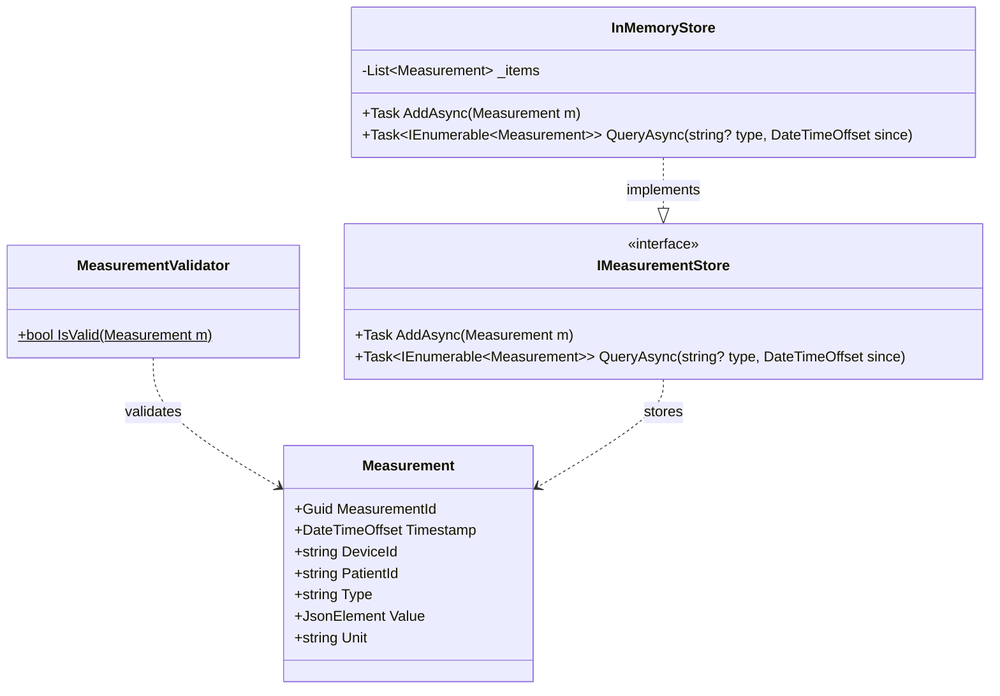

# Data Model: Architecture Modernization

**Date**: 2026-05-20
**Feature**: 001-architecture-modernization

## Entities

### Measurement

A single reading from a medical diagnostic device.

| Field | Type | Constraints |
|-------|------|-------------|
| MeasurementId | `Guid` | Required, non-empty (`Guid.Empty` is invalid) |
| Timestamp | `DateTimeOffset` | Required, non-default |
| DeviceId | `string` | Required, non-blank |
| PatientId | `string` | Required (may be empty for anonymous readings) |
| Type | `string` | Required, non-blank (e.g., "HeartRate", "SpO2", "ECG") |
| Value | `JsonElement` | Required, `ValueKind != Undefined` |
| Unit | `string` | Required (e.g., "bpm", "%", "mV") |

**Identity**: `MeasurementId` (globally unique per reading)

**Immutability**: Measurements are immutable once created — no update or delete operations.

**Representation**: C# `record` type for value equality and immutability semantics.

```csharp
namespace Domain;

/// <summary>
/// Represents a single reading from a medical diagnostic device.
/// </summary>
/// <param name="MeasurementId">Globally unique identifier for this reading.</param>
/// <param name="Timestamp">When the measurement was taken.</param>
/// <param name="DeviceId">Identifier of the source device.</param>
/// <param name="PatientId">Identifier of the patient (may be empty for anonymous).</param>
/// <param name="Type">Category of measurement (e.g., HeartRate, SpO2).</param>
/// <param name="Value">The measurement payload as structured JSON.</param>
/// <param name="Unit">Unit of measurement (e.g., bpm, %).</param>
public record Measurement(
    Guid MeasurementId,
    DateTimeOffset Timestamp,
    string DeviceId,
    string PatientId,
    string Type,
    JsonElement Value,
    string Unit);
```

### MeasurementValidator

Stateless validation logic for `Measurement` instances.

**Rules**:
| Rule | Condition for Invalid |
|------|----------------------|
| V1 | `MeasurementId == Guid.Empty` |
| V2 | `Timestamp == default(DateTimeOffset)` |
| V3 | `string.IsNullOrWhiteSpace(DeviceId)` |
| V4 | `string.IsNullOrWhiteSpace(Type)` |
| V5 | `Value.ValueKind == JsonValueKind.Undefined` |

**Returns**: `bool` — `true` if all rules pass, `false` otherwise.

```csharp
namespace Domain;

/// <summary>
/// Provides stateless validation for <see cref="Measurement"/> instances.
/// </summary>
public static class MeasurementValidator
{
    /// <summary>
    /// Validates that a measurement has all required fields populated.
    /// </summary>
    public static bool IsValid(Measurement m) =>
        m.MeasurementId != Guid.Empty
        && m.Timestamp != default
        && !string.IsNullOrWhiteSpace(m.DeviceId)
        && !string.IsNullOrWhiteSpace(m.Type)
        && m.Value.ValueKind != JsonValueKind.Undefined;
}
```

### IMeasurementStore

Abstraction for measurement persistence and retrieval.

| Method | Signature | Description |
|--------|-----------|-------------|
| AddAsync | `Task AddAsync(Measurement m)` | Persists a single measurement |
| QueryAsync | `Task<IEnumerable<Measurement>> QueryAsync(string? type, DateTimeOffset since)` | Retrieves measurements optionally filtered by type, from a given timestamp |

**Lifecycle**: Implementations determine storage strategy (in-memory, database, file).

```csharp
namespace Domain;

/// <summary>
/// Abstraction for persisting and querying measurements.
/// </summary>
public interface IMeasurementStore
{
    /// <summary>
    /// Persists a measurement to the store.
    /// </summary>
    Task AddAsync(Measurement m);

    /// <summary>
    /// Queries measurements, optionally filtered by type, since a given time.
    /// </summary>
    Task<IEnumerable<Measurement>> QueryAsync(string? type, DateTimeOffset since);
}
```

## Relationships



## State Transitions

Measurements are append-only with no state transitions:

```
Created → Stored → Queried (read-only)
```

No update or delete operations exist in the current scope.
