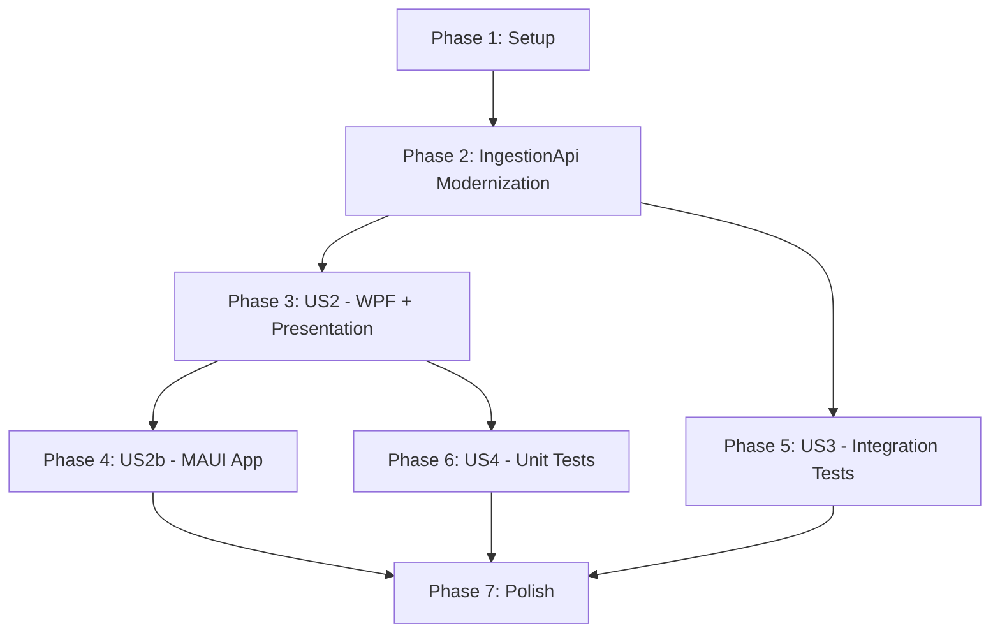

# Tasks: Architecture Modernization

**Input**: Design documents from `/specs/001-architecture-modernization/`

**Prerequisites**: plan.md (required), spec.md (required for user stories), research.md, data-model.md, contracts/

## Format: `[ID] [P?] [Story] Description`

- **[P]**: Can run in parallel (different files, no dependencies)
- **[Story]**: Which user story this task belongs to (e.g., US1, US2, US2b, US3, US4)
- Include exact file paths in descriptions

## Path Conventions

- Source: `src/` at repository root
- Tests: `tests/` at repository root
- Projects: Presentation, IngestionApi, DesktopApp, MauiApp, DeviceSimulator

---

## Phase 1: Setup (Project Initialization)

**Purpose**: Create project shells, configure dependencies, update solution file

- [X] T001 Create class library project file in src/Presentation/Presentation.csproj targeting net8.0 with CommunityToolkit.Mvvm, Microsoft.Extensions.Http, and Microsoft.Extensions.Logging.Abstractions packages
- [X] T002 [P] Create MAUI app project file in src/MauiApp/MauiApp.csproj targeting net9.0-maccatalyst and net9.0-windows10.0.19041.0 with Presentation project reference
- [X] T003 [P] Create test project file in tests/Presentation.Tests/Presentation.Tests.csproj with xUnit, FluentAssertions, NSubstitute packages and Presentation project reference
- [X] T004 Update TakeHome.sln to include Presentation, MauiApp, and Presentation.Tests projects
- [X] T005 [P] Update src/DesktopApp/DesktopApp.csproj to add ProjectReference to Presentation.csproj and Microsoft.Extensions.Hosting package
- [X] T006 Create nuget.config at repo root using only nuget.org source
- [X] T007 Create .gitignore with C#/.NET patterns

**Checkpoint**: All project shells created and solution builds

---

## Phase 2: IngestionApi Modernization (In-Place Domain Improvements)

**Purpose**: Apply architectural improvements directly in IngestionApi — JsonElement Value, enhanced validation. No separate Domain project needed.

- [X] T008 Update src/IngestionApi/Measurement.cs to use JsonElement Value instead of object
- [X] T009 Update src/IngestionApi/MeasurementValidator.cs to validate Value.ValueKind != Undefined
- [X] T010 Verify IngestionApi builds independently: run `dotnet build src/IngestionApi/IngestionApi.csproj` and confirm zero errors

**Checkpoint**: IngestionApi modernized with strongly-typed JsonElement Value

---

## Phase 3: User Story 2 — MVVM WPF Desktop App + Shared Presentation Layer (Priority: P2)

**Goal**: Create shared Presentation library (MainViewModel, MeasurementService) and modernize WPF DesktopApp to consume it via MVVM with DI and async HTTP.

**Independent Test**: Launch DesktopApp with IngestionApi running; measurements auto-poll every 1s, Refresh command works, no UI freezes.

### Implementation for User Story 2

- [X] T011 [P] [US2] Create src/Presentation/Models/MeasurementDto.cs as client-side DTO record for API response deserialization
- [X] T012 [P] [US2] Create src/Presentation/Services/MeasurementService.cs with typed HttpClient wrapper exposing async GetMeasurementsAsync(string? type) and GetHealthAsync() methods
- [X] T013 [US2] Create src/Presentation/ViewModels/MainViewModel.cs with ObservableObject base, ObservableProperty for Measurements (ObservableCollection), StatusMessage (string), IsLoading (bool), RelayCommand for RefreshAsync, auto-poll timer (1s interval), and ILogger injection
- [X] T014 [US2] Rewrite src/DesktopApp/App.xaml.cs to configure ServiceCollection with IHttpClientFactory (base address https://localhost:7296, x-api-key header), register MeasurementService, MainViewModel, MainWindow, and ILogger via AddLogging
- [X] T015 [US2] Update src/DesktopApp/App.xaml to remove StartupUri attribute (window created in code via DI)
- [X] T016 [US2] Rewrite src/DesktopApp/MainWindow.xaml with DataContext binding, DataGrid bound to Measurements, TextBlock bound to StatusMessage, Button bound to RefreshCommand
- [X] T017 [US2] Rewrite src/DesktopApp/MainWindow.xaml.cs to accept MainViewModel via constructor injection and set DataContext, body is only InitializeComponent() plus DataContext assignment
- [X] T018 [US2] Remove all Newtonsoft.Json usage, WebClient, and System.Timers.Timer from DesktopApp (replaced by ViewModel auto-poll). Remove Newtonsoft.Json PackageReference from DesktopApp.csproj

**Checkpoint**: WPF app fully modernized — MVVM, DI, async HTTP, no code-behind logic

---

## Phase 4: User Story 2b — MAUI Cross-Platform App (Priority: P2)

**Goal**: Create .NET MAUI app for Mac Catalyst and Windows reusing the shared Presentation layer (identical MainViewModel and MeasurementService).

**Independent Test**: Build and launch MAUI app on macOS; measurements display and refresh command works identically to WPF app.

### Implementation for User Story 2b

- [X] T019 [P] [US2b] Create src/MauiApp/MauiProgram.cs with CreateMauiApp builder registering IHttpClientFactory (base address, API key), MeasurementService, MainViewModel, MainPage, and ILogger via AddLogging
- [X] T020 [P] [US2b] Create src/MauiApp/App.xaml and src/MauiApp/App.xaml.cs as MAUI Application shell setting MainPage to NavigationPage with MainPage resolved from DI
- [X] T021 [US2b] Create src/MauiApp/MainPage.xaml with CollectionView bound to Measurements, Label bound to StatusMessage, Button bound to RefreshCommand matching WPF data layout
- [X] T022 [US2b] Create src/MauiApp/MainPage.xaml.cs with constructor accepting MainViewModel via DI and setting BindingContext, body is only InitializeComponent() plus BindingContext assignment

**Checkpoint**: MAUI app functional on Mac Catalyst and Windows with shared ViewModel — zero duplicated logic

---

## Phase 5: User Story 3 — Integration Tests for IngestionApi (Priority: P3)

**Goal**: Comprehensive in-process integration tests for all API endpoints covering success, validation failure, and auth failure scenarios.

**Independent Test**: Run `dotnet test tests/IngestionApi.IntegrationTests` — all 6+ tests pass with no external services.

### Implementation for User Story 3

- [X] T023 [US3] Implement HealthEndpoint_ReturnsOk test method in tests/IngestionApi.IntegrationTests/MeasurementApiIntegrationTests.cs asserting GET /healthz returns 200 with status healthy
- [X] T024 [P] [US3] Implement PostValidMeasurement_Returns202Accepted test method with full Measurement payload and Location header assertion
- [X] T025 [P] [US3] Implement PostInvalidMeasurement_Returns400BadRequest test method with empty DeviceId payload
- [X] T026 [P] [US3] Implement RequestWithoutApiKey_Returns401Unauthorized test method using client without x-api-key header
- [X] T027 [P] [US3] Implement QueryByType_ReturnsFilteredResults test method posting multiple types then querying type=HeartRate
- [X] T028 [US3] Implement QueryWithSinceParameter_ReturnsOnlyRecentMeasurements test method verifying time-based filtering

**Checkpoint**: All IngestionApi endpoints tested — 6 test cases covering happy path, validation, auth, and filtering

---

## Phase 6: User Story 4 — Unit Tests for ViewModel (Priority: P4)

**Goal**: Fast, isolated unit tests for MainViewModel command/poll behavior with mocked dependencies.

**Independent Test**: Run `dotnet test tests/Presentation.Tests` — all tests pass in under 5 seconds with no network or UI.

### Implementation for User Story 4

- [X] T029 [P] [US4] Create tests/Presentation.Tests/MainViewModelTests.cs with test: RefreshCommand populates Measurements collection when MeasurementService returns data (mock HttpClient via NSubstitute)
- [X] T030 [P] [US4] Add test: RefreshCommand sets error StatusMessage and does not throw when MeasurementService throws HttpRequestException
- [X] T031 [US4] Add test: MainViewModel auto-poll invokes MeasurementService periodically (verify via mock call count after short delay)

**Checkpoint**: ViewModel behavior fully covered — 3+ unit test cases, all isolated

---

## Phase 7: Polish & Cross-Cutting Concerns

**Purpose**: Build verification and final quality pass

- [X] T032 Verify full solution builds with zero warnings: run `dotnet build TakeHome.sln`
- [X] T033 Verify all tests pass end-to-end: run `dotnet test TakeHome.sln` and confirm zero failures

---

## Phase 8: Runtime Fixes (Post-Implementation)

**Purpose**: Fixes applied during live testing of the full pipeline (API → DeviceSimulator → MAUI app)

- [X] T034 Configure static HTTP port 5100 in src/IngestionApi/Program.cs via `builder.WebHost.UseUrls("http://localhost:5100")`
- [X] T035 [P] Update src/DeviceSimulator/Program.cs to use http://localhost:5100, add SSL bypass handler, add Console.WriteLine for posted measurements
- [X] T036 [P] Update src/MauiApp/MauiProgram.cs HttpClient base address to http://localhost:5100
- [X] T037 [P] Update src/DesktopApp/App.xaml.cs HttpClient base address to http://localhost:5100
- [X] T038 Add NSAppTransportSecurity/NSAllowsLocalNetworking to src/MauiApp/Platforms/MacCatalyst/Info.plist to allow HTTP on Apple platforms
- [X] T039 Fix UI flickering in MainViewModel: replace Clear()/Add() loop with smart diff (MeasurementsEqual) and single collection swap

**Checkpoint**: Full pipeline validated — API, DeviceSimulator, and MAUI app run simultaneously with live data flow

---

## Dependencies



**Story completion order**:
1. US2 (WPF + shared Presentation) — enables US2b and US4
2. US2b (MAUI) — can run parallel with US3/US4 once US2 done
3. US3 (Integration tests) — can run parallel with US2b/US4 once Phase 2 done
4. US4 (Unit tests) — can run parallel with US2b/US3 once US2 done

**Within Phase 2** (T009, T010, T011 parallel — different domain files):
```
T009 ─┐
T010 ─┤→ T012 → T013 → T014 → T015
T011 ─┘
```

**Within Phase 4** (T023, T024 parallel — different MAUI files):
```
T023 ─┐→ T025 → T026
T024 ─┘
```

**Within Phase 5** (T028, T029, T030, T031 parallel — independent test methods):
```
T027 → T028 ─┐
       T029 ─┤→ T032
       T030 ─┤
       T031 ─┘
```

**Within Phase 6** (T033, T034, T035 parallel — independent test files/methods):
```
T033 ─┐→ T036
T034 ─┤
T035 ─┘
```

**Cross-phase parallelism** (after Phase 2 completes):
```
Phase 3 (US2) ──→ Phase 4 (US2b) ──┐
                                     ├→ Phase 7
Phase 5 (US3) ─────────────────────┤
                                     │
Phase 3 (US2) ──→ Phase 6 (US4) ───┘
```

## Implementation Strategy

1. **MVP scope**: Phase 1 + Phase 2 + Phase 3 (Setup + Domain + WPF modernization) delivers a fully functional, testable increment
2. **Incremental delivery**: Each phase is independently verifiable via its checkpoint
3. **Risk mitigation**: Domain extraction (Phase 2) is isolated and reversible; verify build before proceeding
4. **Maximum parallelism**: After Phase 2, US2b/US3 can proceed simultaneously while US4 waits for Presentation layer from US2
